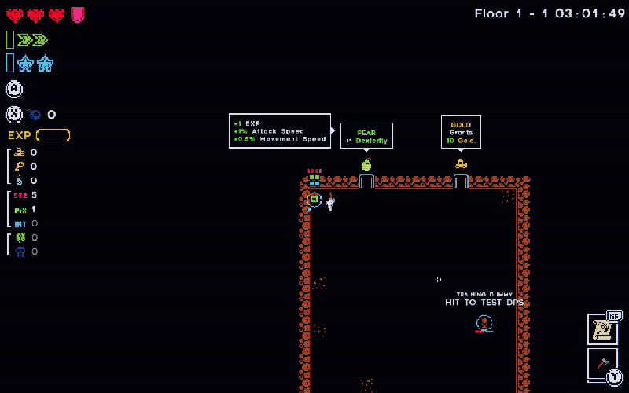

# Tiny Rogues Training Dummy

A simple training dummy and DPS meter for Tiny Rogues.

[**Download the latest release**](https://github.com/tannerbyers/tinyrogues-training-dummy/releases/latest)

## What it does

- Adds an immortal training dummy to each floor's starting area
- Shows DPS, total damage, test duration, and peak hit
- Works with normal attacks, crits, DOTs, procs, companions, and other damage effects
- Stays out of normal room progression

Hit the dummy to start a test. The meter resets automatically after you stop attacking or the test window ends.

## Install

Requires **BepInEx 6 for Unity IL2CPP**.

1. Download the latest release.
2. Extract it into your Tiny Rogues game folder.
3. Launch the game normally.

The mod file should be located at:

`BepInEx/plugins/TinyRoguesTrainingDummy/TinyRogues.TrainingDummy.dll`

## Configuration

Optional settings are created after the first launch at:

`BepInEx/config/tanner.tinyrogues.trainingdummy.cfg`

The defaults are intended for normal use.

## Compatibility

- Tiny Rogues **0.2.8.6**
- Windows
- Steam Deck / Proton

Game updates may require a new version of the mod.

## Uninstall

Delete:

`BepInEx/plugins/TinyRoguesTrainingDummy/`

## Roadmap

See [ROADMAP.md](ROADMAP.md) for planned improvements.

## License

MIT
